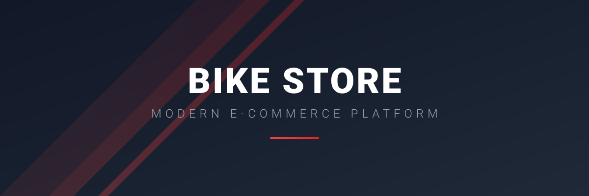
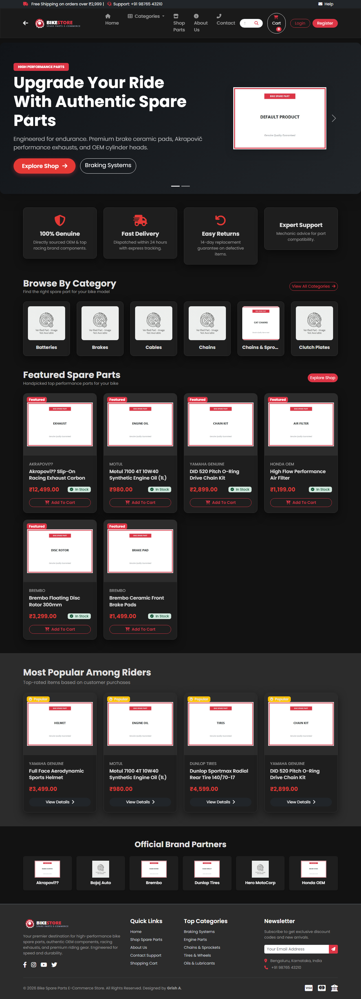
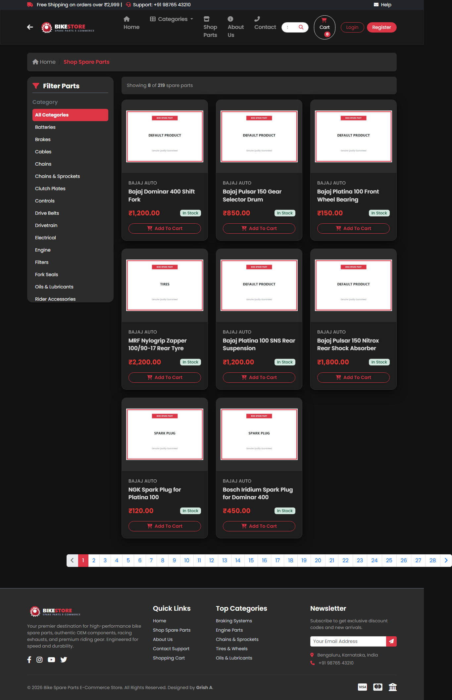
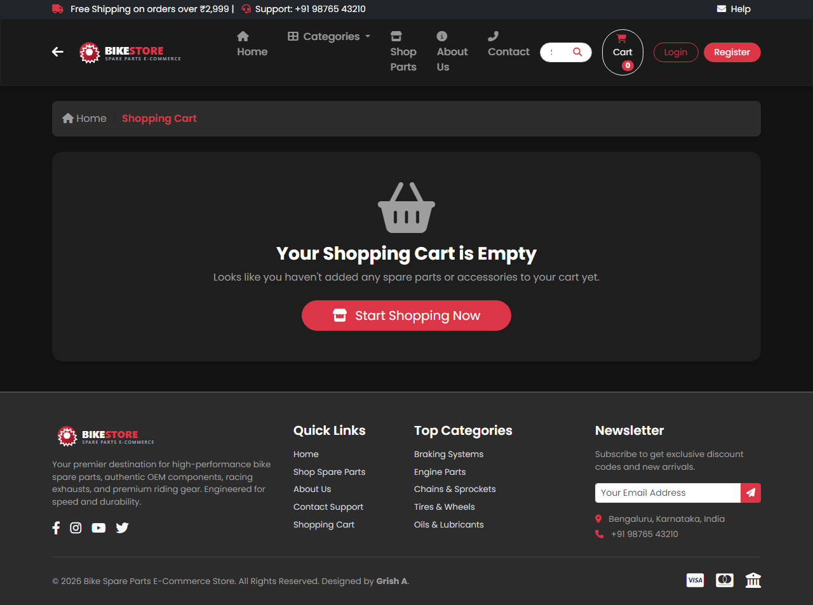
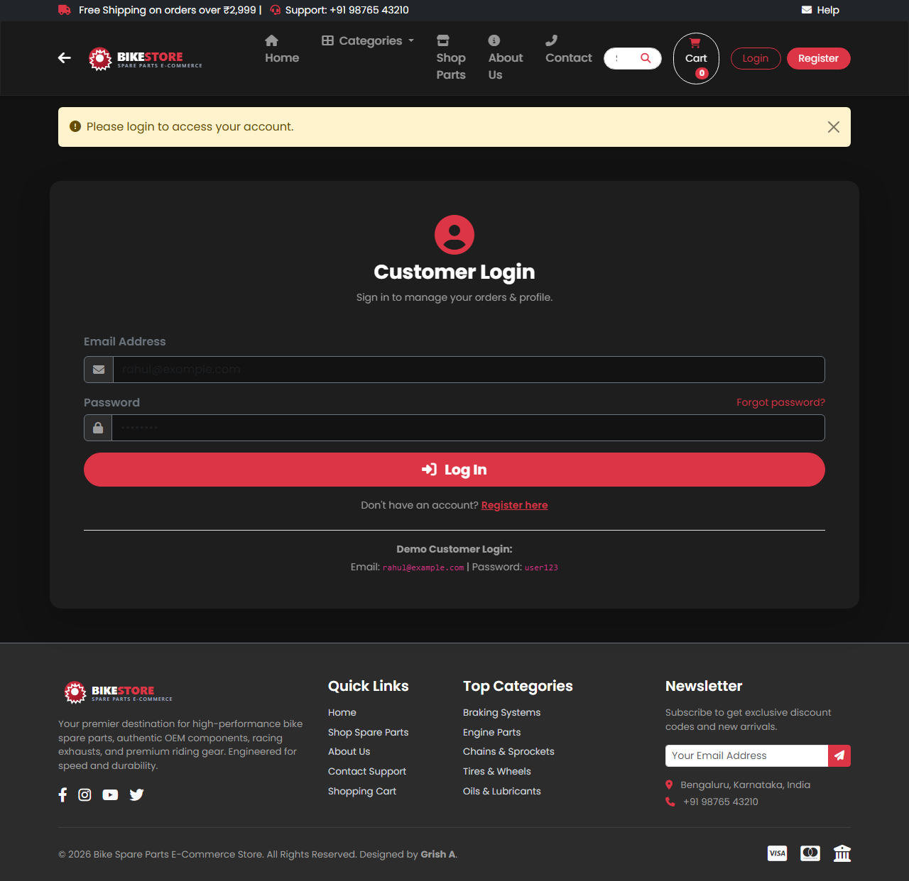
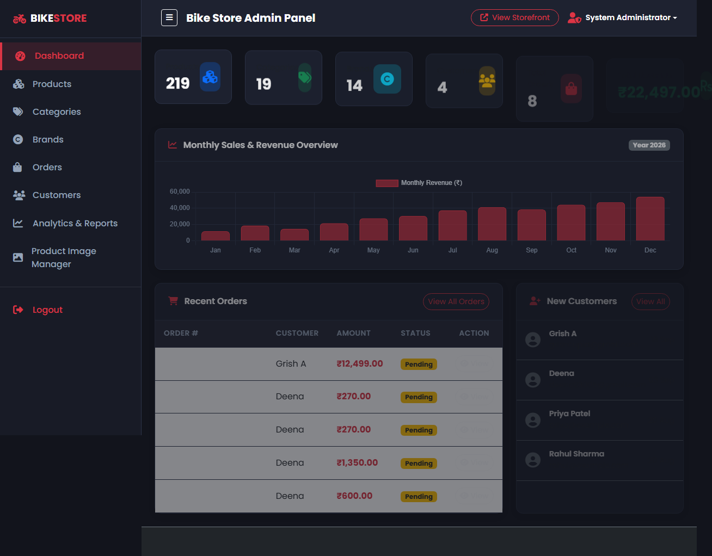
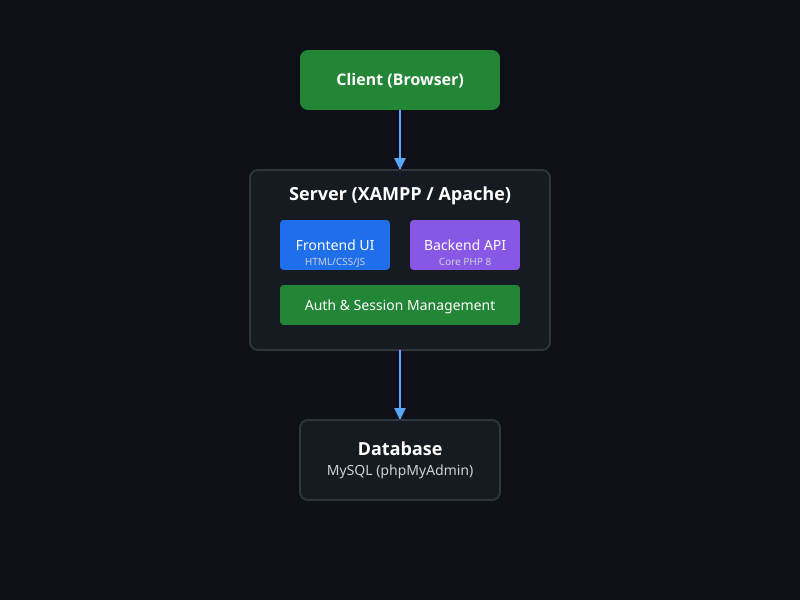
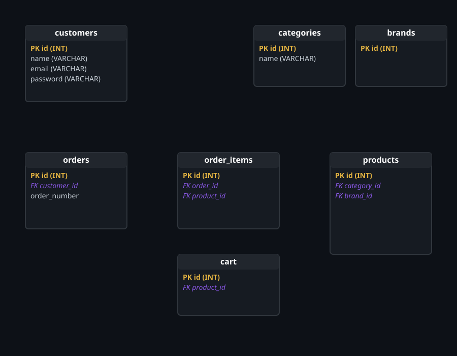

<div align="center">



# 🚲 Bike Store

### A professional, full-featured motorcycle spare parts e-commerce platform.

<p>
  
  
  
  
</p>

<p>
  <a href="#-live-demo">🚧 Live Demo Coming Soon</a>
  •
  <a href="#-features">✨ Features</a>
  •
  <a href="#-installation">⚙️ Installation</a>
</p>

</div>

---

## 📸 Project Preview

<p align="center">
  
  
</p>
<p align="center">
  
  
</p>
<p align="center">
  
  
</p>

---

## 💡 Project Highlights

This platform was built to demonstrate proficiency in full-stack web development using procedural Core PHP. It implements a robust, production-ready e-commerce architecture entirely from scratch without relying on heavy backend frameworks like Laravel.

* **Secure Authentication Flow:** Utilizes `password_hash()` for encryption, custom CSRF token verification, and strict session guards to separate customer and admin portals.
* **Complex Data Relational Models:** Features normalized database structures handling multi-tiered relationships between products, categories, brands, customers, and order invoices.
* **Persistent Cart Lifecycle:** Implements a resilient shopping cart tied to PHP sessions and database persistence, allowing cart retention across multiple visits.
* **Custom Analytics Dashboard:** Features a dynamic admin portal leveraging Chart.js to parse and visualize monthly revenue and order statuses directly from SQL aggregates.
* **Prepared Statements (PDO/mysqli):** 100% of database queries use prepared statements to ensure total immunity against SQL injection attacks.

---

## 🛠️ Tech Stack

| Layer | Technology | Description |
| :--- | :--- | :--- |
| **Frontend** | HTML5, CSS3, JavaScript | Modern, responsive UI utilizing native features. |
| **Styling** | Bootstrap 5.3 | Rapid layout prototyping and responsive mobile-first grid. |
| **Backend** | Core PHP 8 | Handles business logic, authentication, and routing. |
| **Database** | MySQL | Relational data storage for products, orders, and users. |
| **Libraries** | Chart.js, SweetAlert2 | Interactive analytics charts and premium UI notifications. |
| **Local Server** | XAMPP | Standard Apache/MySQL development environment. |

---

## ✨ Features

| Feature | Description |
| :--- | :--- |
| 🏠 **Dynamic Storefront** | Filterable product catalog with pagination, brand sorting, and search. |
| 🛡️ **Admin Portal** | Complete CMS (CRUD) for managing inventory, categories, and brands. |
| 🛒 **Smart Cart** | Real-time total calculation and free shipping threshold counter. |
| 👤 **User Accounts** | Registration, secure login, profile management, and order history. |
| 📦 **Order Fulfillment** | Multi-step checkout with COD/UPI mocks and invoice generation. |
| 📊 **Analytics** | Visual charts and printable CSV reports for business intelligence. |

---

## 🏗️ System Architecture



The application follows a traditional Client-Server architecture. The frontend leverages Bootstrap and Vanilla JS to communicate with the Apache web server. The backend logic is processed by Core PHP scripts, securely querying the MySQL database using prepared statements and returning the rendered HTML views.

---

## 🗄️ Database Architecture



The database (`bike_store`) is highly normalized and relies on strict foreign key constraints (CASCADE deletions) to maintain referential integrity between orders, customers, and product inventory.

---

## 🌐 Live Demo

🚧 **Live Demo Coming Soon**

The project is currently configured for local development using XAMPP. A cloud deployment (e.g., Heroku/AWS) can be implemented in a future release. 

Once running locally, the application can be accessed at:
`http://localhost/Bike_store-main/`

---

## 📁 Project Structure

```text
Bike_store-main/
├── admin/               # Administrative CMS portal & analytics
├── assets/              # CSS, JS, Fonts, and static images
├── database/            # SQL dumps, seed files, and migrations
├── docs/                # Architecture diagrams
├── includes/            # Reusable PHP partials and configurations
├── screenshots/         # Project preview images and banners
├── uploads/             # Dynamic user/product image storage
├── index.php            # Storefront homepage
├── shop.php             # Product catalog and filtering logic
├── cart.php             # Shopping cart management
├── checkout.php         # Order processing
└── README.md            # Project documentation
```

---

## ⚙️ Installation

### Prerequisites
* **XAMPP** (or equivalent LAMP/WAMP stack)
* **PHP 8.0+**
* **MySQL / MariaDB**

### Setup Guide

1. **Clone the Repository**
   ```bash
   git clone https://github.com/Grish2219/Bike_store-main.git
   ```

2. **Move Project**
   Move the cloned `Bike_store-main` folder into your XAMPP `htdocs` directory:
   `C:\xampp\htdocs\Bike_store-main`

3. **Start Local Server**
   Open the XAMPP Control Panel and start both **Apache** and **MySQL**.

4. **Database Setup**
   * Open [http://localhost/phpmyadmin](http://localhost/phpmyadmin)
   * Create a new database named `bike_store`.
   * Go to the **Import** tab and upload `bike_store.sql` located in the root directory.

5. **Launch Application**
   * **Storefront:** [http://localhost/Bike_store-main/](http://localhost/Bike_store-main/)
   * **Admin Panel:** [http://localhost/Bike_store-main/admin/login.php](http://localhost/Bike_store-main/admin/login.php)

---

## 🧪 Testing (Manual Workflow)

To verify the installation, you can perform the following test flow:
1. Open the homepage and browse the featured products.
2. Navigate to the **Shop** page and filter items by the 'Brembo' brand.
3. Click on a product to view its detailed specifications and image gallery.
4. Add the product to your cart, modify the quantity, and verify the subtotal updates.
5. Proceed to Checkout, register a new customer account, and complete a COD order.
6. Log in to the Admin Panel (`admin` / `admin123`) to view the new order in the dashboard.

---

## 🔐 Security Notes

* **Data Integrity:** All database interactions utilize parameterized queries (`mysqli->prepare`).
* **Session Security:** The application uses isolated session namespaces to prevent privilege escalation.
* **Configuration:** Currently, database connection parameters are stored in `includes/db.php`. For a production deployment, these should be abstracted into a `.env` file that is excluded via `.gitignore`.
* **Important:** Never commit production API keys, SMTP credentials, or database passwords to this repository.

---

## 🗺️ Roadmap

- [ ] Deploy production version to a cloud provider.
- [ ] Implement a live Payment Gateway integration (Stripe/Razorpay).
- [ ] Add real-time email notifications for order status updates.
- [ ] Implement advanced automated unit testing (PHPUnit).

---

## 👨‍💻 Author

**Grish A**

Student Developer | Web Development | Software Projects
[GitHub Profile](https://github.com/Grish2219)

---

## 📝 License

This is an Open Source Educational Project. No formal license is currently attached. (MIT License recommended for future distribution).
